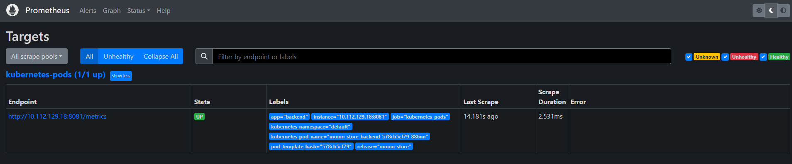

# Репозиторий инфраструктуры <!-- omit in toc -->

В данном репозитории хранится инфраструктурная часть проекта "Пельменная".

[Momo Store](https://gitlab.praktikum-services.ru/std-018-014/momo-store)

# Оглавление <!-- omit in toc -->

- [Cтруктура репозитория](#cтруктура-репозитория)
- [Подготовка инфраструктуры](#подготовка-инфраструктуры)
  - [Создание кластера в Yandex Cloud](#cоздание-кластера-в-Yandex-Cloud)
  - [Кластер и хранилище](#кластер-и-хранилище)
  - [Подготовка кластера](#подготовка-кластера)
- [Установка ArgoCD](#установка-argocd)
- [Установка Prometheus](#установка-prometheus)
- [Установка Grafana](#установка-grafana)
- [Правила версионирования](#правила-версионирования)
- [Правила внесения изменений в репозиторий](#правила-внесения-изменений-в-репозиторий)


# Cтруктура репозитория

```
.
├── chart                    - Helm чарт приложения
├── kubernetes-system        - Чарты и манифесты для дополнительных компонентов инфраструктуры
│   ├── argocd               - Декларативный GitOps-инструмент непрерывной доставки
│   ├── grafana              - Система визуализации данных
│   ├── prometheus           - Cистема мониторинга и оповещения о событиях
│   ├── acme-issuer.yaml     - Для получения сертификата в Let's Encrypt
│   ├── README.md            - Нужно дооформить
│   └── service-account.yaml - Сервисный аккаунт с которого будем работать
├── manifests                - манифесты для развертывания вручную (DockerCompose) Нужно доделать !!!
├── terraform                - манифесты IaC (также папка с картинками, которые загружаются в S3 при развертывании)
├── .gitlab-ci.yml
└── README.md
```

# Подготовка инфраструктуры

## Кластер и хранилище

Подключаемся к Yandex Cloud

1. Создадим авторизованный ключ для сервисного аккаунта и запишем его файл:

```bash
yc iam key create \
  --service-account-id <идентификатор_сервисного_аккаунта> \
  --folder-name <имя_каталога_с_сервисным_аккаунтом> \
  --output key.json
```
Где:

  - service-account-id — идентификатор сервисного аккаунта.
  - folder-name — имя каталога, в котором создан сервисный аккаунт.
  - output — имя файла с авторизованным ключом.


Пример результата:

```bash
id: aje8nn871qo4a8bbopvb
service_account_id: ajehr0to1g8bh0la8c8r
created_at: "2022-09-14T09:11:43.479156798Z"
key_algorithm: RSA_2048
```
2. Создаем профиль CLI для выполнения операций от имени сервисного аккаунта. Укажите имя профиля:

```bash
yc config profile create <имя_профиля>
```

Результат:

```bash
Profile 'sa-terraform' created and activated
```

Где:
  - service-account-key — файл с авторизованным ключом сервисного аккаунта.
  - cloud-id — идентификатор облака.
  - older-id — идентификатор каталога.

3. Добавьте аутентификационные данные в переменные окружения:

```bash
export YC_TOKEN=$(yc iam create-token)
export YC_CLOUD_ID=$(yc config get cloud-id)
export YC_FOLDER_ID=$(yc config get folder-id)
```

Где:

  - YC_TOKEN — IAM-токен.
  - YC_CLOUD_ID — идентификатор облака.
  - YC_FOLDER_ID — идентификатор каталога.


## Создание кластера в Yandex Cloud

Создавать K8s кластер будем при помощи Terraform. Terraform позволяет быстро создать облачную инфраструктуру в Yandex Cloud и управлять ею с помощью файлов конфигураций. В файлах конфигураций хранится описание инфраструктуры на языке HCL (HashiCorp Configuration Language). Terraform и его провайдеры распространяются под лицензией Business Source License.

Предварительно создадим бакет в S3 хранилище для сохранения состония работы terraform

```bash
export AWS_ACCESS_KEY_ID="<идентификатор_ключа>"
export AWS_SECRET_ACCESS_KEY="<секретный_ключ>"
```

После чего развернем кластер

```bash
cd terraform
terraform apply
```

## Настройка доступа подключения к K8s

Получаем ID кластера. В панели управления Идентификатор_кластера находится по пути Managed Service for Kubernetes/Кластеры/ваш_кластер -> обзор -> основное -> Идентификатор

Или командой yc managed-kubernetes cluster list в поле ID

```bash
yc managed-kubernetes cluster get-credentials --id Идентификатор_кластера --external
```

Проверка доступности кластера

```bash
kubectl cluster-info
```

Делаем бэкап текущего ./kube/config

```bash
cp ~/.kube/config ~/.kube/config.bak
```

Создаем манифест service-account.yaml

```bash
apiVersion: v1
kind: ServiceAccount
metadata:
  name: admin-user
  namespace: kube-system
---
apiVersion: rbac.authorization.k8s.io/v1
kind: ClusterRoleBinding
metadata:
  name: admin-user
roleRef:
  apiGroup: rbac.authorization.k8s.io
  kind: ClusterRole
  name: cluster-admin
subjects:
- kind: ServiceAccount
  name: admin-user
  namespace: kube-system
```

И применяем его

```bash
kubectl apply -f gitlab-admin-service-account.yaml
```

Получаем KUBE_TOKEN

```bash
kubectl apply -f gitlab-admin-service-account.yaml
```

Получаем endpoint. Публичный ip адрес находится по пути Managed Service for Kubernetes/Кластеры/ваш_кластер -> обзор -> основное -> Публичный IPv4

Получаем KUBE_TOKEN

```bash
kubectl -n kube-system get secrets -o json | jq -r '.items[] | select(.metadata.name | startswith("admin-user")) | .data.token' | base64 --decode
```

Генерируем конфиг

```bash
export KUBE_URL=https://<Публичный адрес K8s>   # Важно перед IP указать https://
export KUBE_TOKEN=<Полученный ранее>
export KUBE_USERNAME=admin-user
export KUBE_CLUSTER_NAME=<Идентификатор_КЛАСТЕРА>

kubectl config set-cluster "$KUBE_CLUSTER_NAME" --server="$KUBE_URL" --insecure-skip-tls-verify=true
kubectl config set-credentials "$KUBE_USERNAME" --token="$KUBE_TOKEN"
kubectl config set-context default --cluster="$KUBE_CLUSTER_NAME" --user="$KUBE_USERNAME"
kubectl config use-context default
```
## Подготовка кластера

Чтобы с помощью Kubernetes создать Ingress-контроллер NGINX и защитить его сертификатом Let's Encrypt®, выполните следующие действия:

 Устанавливаем NGINX Ingress Controller

```bash
kubectl apply -f https://raw.githubusercontent.com/kubernetes/ingress-nginx/controller-v1.5.1/deploy/static/provider/cloud/deploy.yaml
```

Устанавливаем менеджер сертификатов:

```bash
kubectl apply -f https://github.com/jetstack/cert-manager/releases/download/v1.6.1/cert-manager.yaml
```

Также нужно создайть манифест acme-issuer.yaml

```bash
kubectl apply -f acme-issuer.yaml
```
В поле mail вводим валидный адрес электронной почты. 

Манифест sa.yml необходим для создания сервисного аккуанта для последующего формирования статического конфига для доступа к кластеру, например из CI/CD

```bash
kubectl apply -f service-account.yaml
```

## Узнайтем IP-адрес Ingress-контроллера

Нам нужно значение из колонки EXTERNAL-IP:

```bash
kubectl get svc -n ingress-nginx
```
## Создадим публичную DNS запись для доступа к магазину из интернета

Для этого воспользуемся бесплатным ресурсом https://freedns.afraid.org
Регистрация на нем бесплатная, создаем DNS запись, основываясь инструкцией на сайте.
Указываем IP-адрес из предыдущего пункта и сохраним этот субдомен в качестве переменной MOMO_URL в Gitlab в настройках CI/CD


## Установка ArgoCD

Доступ к ArgoCD можно получить по ссылке https://argocd.momo-diplom-yandex.mooo.com
```bash
cd kubernetes-system/argocd
kubectl create namespace argocd
kubectl apply -n argocd -f https://raw.githubusercontent.com/argoproj/argo-cd/stable/manifests/install.yaml
kubectl apply -n argocd -f ingress.yml
kubectl apply -n argocd -f user.yml
kubectl apply -n argocd -f policy.yml
```
# Установка Prometheus

За основу взят helm chart с sasusage-store, был добавлен только Ingress контроллер, для доступа к сервису
Сервис располагается по адресу: https://prometheus.momo-diplom-yandex.mooo.com

```bash
cd kubernetes-system
helm upgrade --install prometheus prometheus/
```
Видим, что данные приходят и логи собираются



# Установка Grafana

За основу взят helm chart с sasusage-store, был добавлен только Ingress контроллер, для доступа к сервису
Сервис располагается по адресу: https://grafana.momo-diplom-yandex.mooo.com/

```bash
cd kubernetes-system
helm upgrade --install grafana grafana/
```
При входе меняем дефодтный пароль admin/admin


# Правила версионирования

Версия приложения формируется из переменной `VERSION` в пайплайне - `1.0.${CI_PIPELINE_ID}`

Контейнеры фронтенда и бэкенда собираются и публикуются в отдельных пайплайнах, при сборке каждый образ получает тег с номером версии приложения. После тестирования образа на успешный запуск и отработку запросов (Postman), образ тегируется как latest.

Образы публикуются в GitLab Container Registry.

# Правила внесения изменений в репозиторий

Все изменения должны производиться в отдельном бранче с последующим MR.
